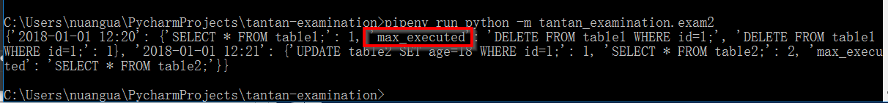

Getting Started
================

This document will show you how to install and use tantan-examination.

* install python(python2 or python3 both OK) and pipenv

For Usage

    * pip install https://github.com/nuangua/tantan-examination/raw/master/dist/tantan-examination-1.0.0.tar.gz
    * python -m tantan_examination.exam2

For development

`pip install -U pipenv`

*  install python dependencies

`pipenv run pip install sphinx sphinx-autobuild sphinx_rtd_theme`

*  compile

`pipenv run python setup.py sdist bdist_wheel build_sphinx`

